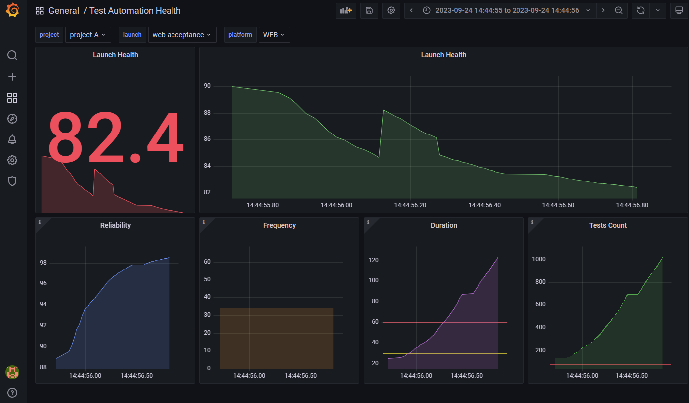

## test-automation-dashboard

Test automation health calculation, visualisation, storing historical data across multiple projects/products/teams.

Mainly focused on e2e/acceptance tests health metrics.

#### Data sources:

- [ReportPortal](https://reportportal.io/) - (test execution metrics)
- [TestRail](https://www.testrail.com/) - (test coverage by test-cases/requirements metrics)

might be extended as next steps.

#### Visualisation:

- [Grafana](https://grafana.com/grafana/)
- [postgres](https://www.postgresql.org/)

### WIP

Current state is prototype on mocks.